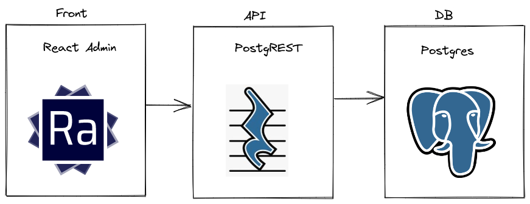

<!-- prettier-ignore -->
# greenframe-demo-ra

A demo project to demonstrate greenframe integration with github.

The project is composed of a front end ([React admin](https://marmelab.com/react-admin/)) and a backend ([Postgrest](https://postgrest.org/)) connected to a db in Postgres.

## Getting started

### Install dependencies

Run `make install` to install the dependencies. It will also init and seed the db with [data-generator-retail](https://www.npmjs.com/package/data-generator-retail).

### Start the project

Run `make start` to start the server. It will start :

- The db (postgres) on port 5432
- The api (using postgrest) on port 8000
- The frontend (React admin) on port 3000

Go to http://localhost:3000 to see the app.

### Stop the project

Run `make stop` to stop the server. It will remove the containers, so the data will be lost.
